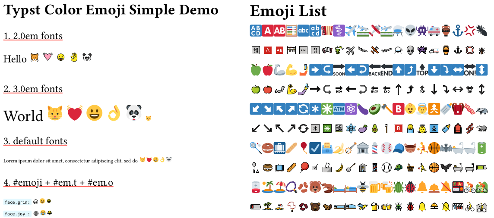

# Typst Color emoji

A simple library for drawing color emoji for Typst. Drawing using [twemoji](https://github.com/twitter/twemoji) and [openmoji](https://github.com/hfg-gmuend/openmoji) open-source emoji libraries.

# Getting Started

1. import "typst-color-emoji"

   ```c
   #import "typst-color-emoji/cm.typ"
   ```

2. draw [twemoji](https://github.com/twitter/twemoji) type emoji

   ```c
   #cm.t("face.grin")
   ```

3. draw [openmoji](https://github.com/hfg-gmuend/openmoji) type emoji

   ```c
   #cm.o("face.grin")
   ```

4. for more emoji, please refer to [emoji](https://typst.app/docs/reference/symbols/emoji/)

# Simple Demo

The [simple.typ](examples/simple.typ) example draws the following effect.


